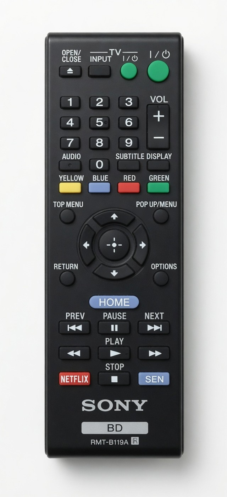
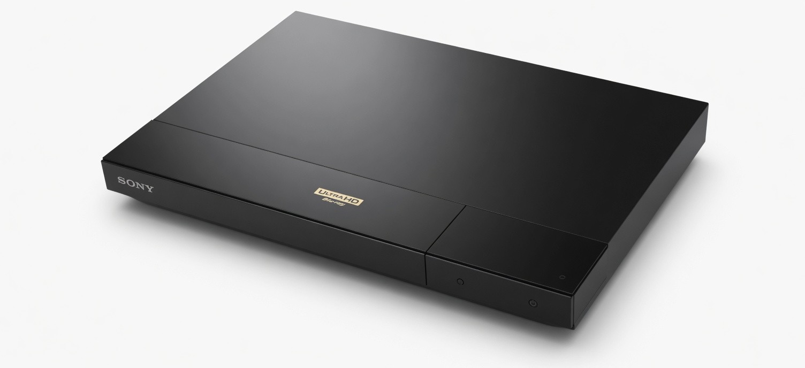
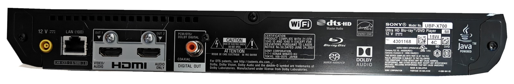
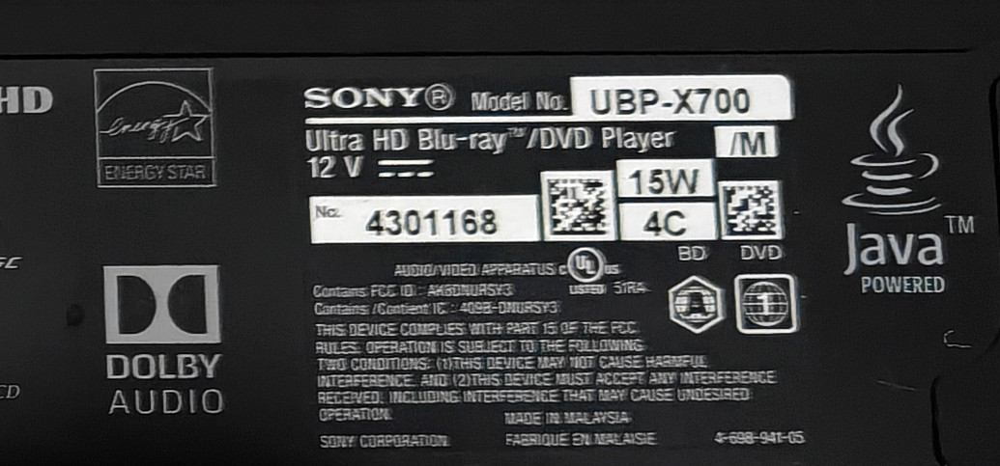

# Sony UBP-X700 Ultra HD Blu-ray player

[Sony](../) · [Bluray Players](../../) · [Infrared](../../../)

Slim 4K Ultra HD Blu-ray / DVD player with a bundled RMT-B119A IR remote. Player keys are Sony **SIRC20**.







## Identification

The rating block is a crop of the real rear panel (not redrawn).



| Field | Value |
|-------|--------|
| Brand on plate | SONY |
| Model | UBP-X700 |
| Suffix on plate | `/M` |
| Product | Ultra HD Blu-ray / DVD Player |
| Power | 12 V⎓, 15 W (external adaptor) |
| Serial | `4301168` |
| Printed marks | `4C` with BD / DVD icons |
| FCC ID (printed as Contains) | [`AK8DNURSY3`](https://fccid.io/AK8DNURSY3) |
| ISED / IC | `409B-DNURSY3` |
| What the grant is | Sony WLAN module DNURSY3, 2412–2462 MHz (2.4 GHz). The player **contains** this module. |
| Grantee | Sony Corporation, 1-7-1 Konan, Minato-ku, Tokyo 108-0075, Japan |
| Other | UL E511RA, CAN ICES-3 (B) / NMB-3 (B), Energy Star, Made in Malaysia, part `4-698-941-05` |
| Remote | RMT-B119A, IR, BD |

Rear ports, left to right: 12 V DC, Ethernet `LAN (100)`, HDMI OUT 1 (video/audio), HDMI OUT 2 (audio only), coaxial digital out (PCM/DTS/Dolby Digital). USB is on the front (not in these photos).

## Flipper file

[`Sony_UBP-X700.ir`](Sony_UBP-X700.ir) — copy to the Flipper SD card under `infrared/`. Parsed SIRC20, player address `5A 1C`.

TV-specific keys on this remote were **not mapped**. They talk to a Sony TV, not the Blu-ray player:

- **TV INPUT**
- Small green **TV power**
- **VOL +** / **VOL −** (15-bit SIRC address `01`)

Those volume codes were removed from the Flipper export. Do not invent TV commands.

## Remote buttons

Layout matches the remote photo, top to bottom. Player keys only:

| Remote | Flipper name | Protocol | Address | Command |
|--------|--------------|----------|---------|---------|
| OPEN/CLOSE | Open-Close | SIRC20 | `5A 1C` | `0x16` |
| Player power (large green) | Power | SIRC20 | `5A 1C` | `0x15` |
| 1 … 9, 0 | 1 … 9, 0 | SIRC20 | `5A 1C` | `0x00`–`0x08`, `0x09` |
| AUDIO | Audio | SIRC20 | `5A 1C` | `0x64` |
| SUBTITLE | Subtitle | SIRC20 | `5A 1C` | `0x63` |
| DISPLAY | Display | SIRC20 | `5A 1C` | `0x41` |
| YELLOW / BLUE / RED / GREEN | Yellow Blue Red Green | SIRC20 | `5A 1C` | `0x69` `0x66` `0x67` `0x68` |
| TOP MENU | Top Menu | SIRC20 | `5A 1C` | `0x2C` |
| POP UP/MENU | Pop Up-Menu | SIRC20 | `5A 1C` | `0x29` |
| RETURN | Return | SIRC20 | `5A 1C` | `0x43` |
| OPTIONS | Options | SIRC20 | `5A 1C` | `0x3F` |
| D-pad / ENTER | Up Down Left Right Enter | SIRC20 | `5A 1C` | `0x39` `0x3A` `0x3B` `0x3C` `0x3D` |
| HOME | Home | SIRC20 | `5A 1C` | `0x42` |
| PREV / PAUSE / NEXT | Prev Pause Next | SIRC20 | `5A 1C` | `0x57` `0x19` `0x56` |
| Rewind / PLAY / Fast forward | Rewind Play Fast Forward | SIRC20 | `5A 1C` | `0x1B` `0x1A` `0x1C` |
| NETFLIX | Netflix | SIRC20 | `5A 1C` | `0x4B` |
| STOP | Stop | SIRC20 | `5A 1C` | `0x18` |
| SEN | Sen | SIRC20 | `5A 1C` | `0x4C` |

Player keys in the `.ir` file look like:

```
protocol: SIRC20
address: 5A 1C 00 00
command: XX 00 00 00
```

Same address and commands work from any SIRC blaster (Flipper, ESPHome `sony` protocol, Arduino IRremote).

## Notes

- Player power is a toggle. There is no separate on and off code.
- OPEN/CLOSE is the tray. The front-right standby mark on `unit.jpg` is the player, not the remote.
- SEN is the Sony Entertainment Network / video-store shortcut on this remote generation.
- No codes were synthesized.
