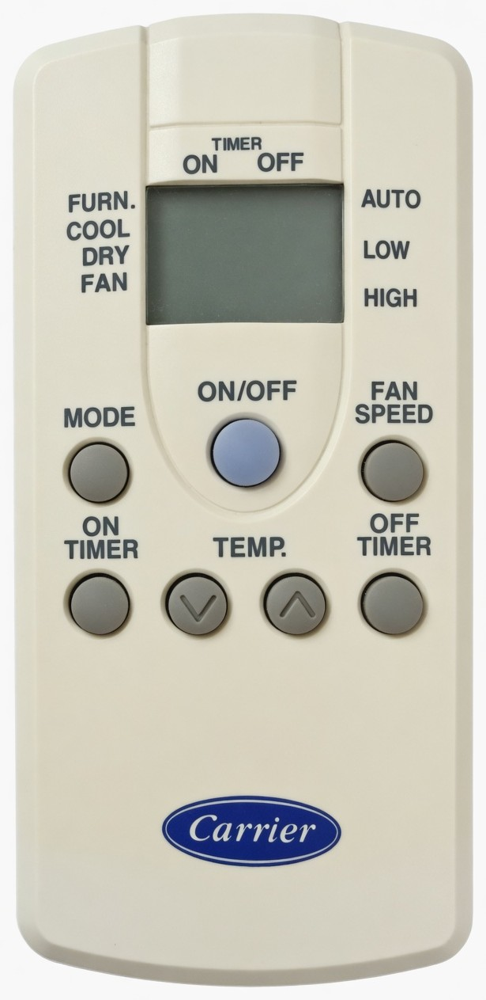
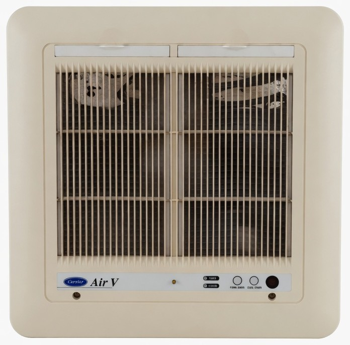

# Carrier Air V ceiling cassette

[Carrier](../) · [HVAC](../../) · [Infrared](../../../)

Older Carrier ceiling cassette with a cream handheld remote. The indoor unit is labeled **Air V**. The remote is a full-state IR controller: every key sends the entire climate snapshot (power, mode, fan, setpoint), not a one-shot "temp up" pulse.





## Flipper file

[`Carrier_Air_V.ir`](Carrier_Air_V.ir) — copy to the Flipper SD card under `infrared/`.

Cool, Dry, Fan, Off, Furnace, `Off_Timer_1H`, and `Off_Timer_12H` are **raw Flipper captures**. `Off_Timer_2H` through `Off_Timer_11H` are synthesized from those two timer captures (see below).

| Flipper name | What it sends |
|--------------|----------------|
| `Off` | Power off (Dry Auto was selected on the remote when this was learned) |
| `Cool_63_Auto` | Cool, auto fan, 63 °F |
| `Cool_75_Auto` | Cool, auto fan, 75 °F |
| `Cool_90_Auto` | Cool, auto fan, 90 °F |
| `Cool_75_Low` | Cool, low fan, 75 °F |
| `Cool_75_High` | Cool, high fan, 75 °F |
| `Dry_63_Auto` | Dry, auto fan, 63 °F |
| `Dry_70_Auto` | Dry, auto fan, 70 °F |
| `Dry_81_Auto` | Dry, auto fan, 81 °F |
| `Dry_90_Auto` | Dry, auto fan, 90 °F |
| `Fan_Low` | Fan only, low |
| `Fan_High` | Fan only, high |
| `Furn_45_Auto` | Furnace (heat), auto fan, 45 °F |
| `Furn_90_Auto` | Furnace (heat), auto fan, 90 °F |
| `Off_Timer_1H` … `Off_Timer_12H` | Off timer, 1–12 hours, while set to Furnace 45 °F Auto |

Send **Off** to stop the unit. Send a `Cool_*` / `Dry_*` / `Fan_*` / `Furn_*` button to start it in that state. There is no separate "on" code.

**ON TIMER** on this remote did not emit IR (no capture). **OFF TIMER** does, as a second 36-bit message after the climate snapshot. Intermediate furnace setpoints between 45 °F and 90 °F were not in the learn file — only the ends of that range.

## Remote and indoor unit

Remote keys, matching the photo:

- **TIMER ON / OFF** slider above the LCD
- **MODE** cycles FURN. → COOL → DRY → FAN
- **FAN SPEED** cycles AUTO → LOW → HIGH
- **ON/OFF** (blue) is power
- **TEMP.** down / up
- **ON TIMER** / **OFF TIMER**

The cassette nameplate (from the original photo, left to right) is **Carrier Air V**, a gold LED, **TIMER** and **UNIT ON** indicators, **FURN EMER.** and **COOL EMER.** lamps, then the IR receiver window.

## Protocol

This is **not** NEC. Flipper could not parse it, so the `.ir` file is raw.

### Wire format

| Item | Value |
|------|--------|
| Carrier | 38 kHz, 33% duty |
| Encoding | Pulse-distance (NEC-like marks, not NEC framing) |
| Header | ~8240 µs mark, ~4156 µs space |
| Bit mark | ~532 µs |
| Bit 0 space | ~500 µs |
| Bit 1 space | ~1530 µs |
| Payload | **36 bits**, MSB first |
| Trailer | one stop mark (~532 µs) |
| Repeat | **three frames**: `data`, `bitwise NOT data`, `data` |
| Gap between frames | ~20 ms |

That timing is the same family as IRremoteESP8266 **CARRIER_AC40** (`kCarrierAc40HdrMark` 8402, space 4166, bit 547, one 1540, zero 497). Two differences from that library's AC40 helper:

1. Bit count here is **36**, not 40.
2. The invert-middle triple is how **CARRIER_AC** (32-bit) is sent. AC40's `sendCarrierAC40()` does not invert; this remote does.

ESPHome / IRremoteESP8266 can still emit it with `sendRaw` (or `sendGeneric` three times with the inverted copy in the middle). Do not send a single 40-bit AC40 frame and expect this cassette to listen.

### 36-bit layout

Bits 0–35, MSB first, grouped as 8+8+8+8+4:

```
BBBBBBBB BBBBBBBB TTTTTTTT MMMMxxxx NNNN
   B3       35       TT       MM       N
```

| Field | Bits | Observed values |
|-------|------|-----------------|
| Device ID | 0–15 | Always `B3 35` |
| Setpoint / power mix | 16–23 | See table below |
| Mode + fan | 24–31 | Low nibble always `F`. High nibble picks mode/fan |
| Trailer nibble | 32–35 | `C` for Cool / Dry / Off / Furnace 90. `E` for Fan-only and Furnace 45 |

Frame 2 is the bitwise inverse of this whole 36-bit word (`B3 35 …` → `4C CA …`).

#### Byte 2 (setpoint), captured

| Display °F | Byte 2 | Notes |
|------------|--------|--------|
| 45 | `A6` | Furnace Auto only so far |
| 63 | `A0` | Cool Auto and Dry Auto used the same byte |
| 70 | `A2` | Dry Auto only |
| 75 | `AE` | Cool Auto / Low / High |
| 81 | `A5` | Dry Auto |
| 90 | `AF` | Cool, Dry, Fan, and Furnace 90 |
| Off | `D2` | Power-off overlay; not a setpoint |
| Off timer enable | `E6` | Furnace 45 (`A6`) with bit 17 set |

90 °F is `AF` in Cool, Dry, Fan, and Furnace, so byte 2 is independent of mode at that setpoint. Do not assume a linear °F formula. Off and the off-timer flag each flip bits in this byte rather than using a dedicated nibble.

#### Byte 3 (mode + fan), captured

| Mode + fan | Byte 3 | Trailer nibble |
|------------|--------|----------------|
| Dry Auto | `AF` | `C` |
| Cool Auto | `6F` | `C` |
| Cool High | `9F` | `C` |
| Cool Low | `EF` | `C` |
| Furnace Auto | `8F` | `C` at 90 °F, `E` at 45 °F |
| Fan Low | `5F` | `E` |
| Fan High | `3F` | `E` |
| Off (with Dry Auto behind it) | `AF` | `C` |

The low nibble of byte 3 stayed `F` on every capture. Furnace Auto is high nibble `8`. Trailer `C` vs `E` is not a simple Cool/Fan split: Furnace 45 uses `E` like Fan-only, Furnace 90 uses `C` like Cool/Dry. Keep the captured trailer when you splice.

#### Full captured payloads

MSB hex, last character is the 4-bit trailer:

```
Off            B3 35 D2 AF C
Cool_63_Auto   B3 35 A0 6F C
Cool_75_Auto   B3 35 AE 6F C
Cool_90_Auto   B3 35 AF 6F C
Cool_75_Low    B3 35 AE EF C
Cool_75_High   B3 35 AE 9F C
Dry_63_Auto    B3 35 A0 AF C
Dry_70_Auto    B3 35 A2 AF C
Dry_81_Auto    B3 35 A5 AF C
Dry_90_Auto    B3 35 AF AF C
Fan_Low        B3 35 AF 5F E
Fan_High       B3 35 AF 3F E
Furn_45_Auto   B3 35 A6 8F E
Furn_90_Auto   B3 35 AF 8F C
```

No checksum over those bytes jumped out of the captures (nibble sums do not match the trailer). Treat the trailer nibble as part of the constant mode encoding (`C` vs `E`) unless a capture says otherwise.

### Off timer (two messages)

OFF TIMER does not share the climate snapshot. Each press sends **two** 36-bit triples back-to-back (six frames total):

1. Climate snapshot with the off-timer flag: Furnace 45 Auto `A6 8F E` becomes `E6 8F E` (bit 17 set).
2. Duration word `B3 35 7X F1 0`, where `X` is the **bit-reversed** 4-bit hour (1–12).

| Hours | Packet 2 |
|-------|----------|
| 1 | `B3 35 78 F1 0` (captured) |
| 2 | `B3 35 74 F1 0` |
| 3 | `B3 35 7C F1 0` |
| 4 | `B3 35 72 F1 0` |
| 5 | `B3 35 7A F1 0` |
| 6 | `B3 35 76 F1 0` |
| 7 | `B3 35 7E F1 0` |
| 8 | `B3 35 71 F1 0` |
| 9 | `B3 35 79 F1 0` |
| 10 | `B3 35 75 F1 0` |
| 11 | `B3 35 7D F1 0` |
| 12 | `B3 35 73 F1 0` (captured) |

1 and 12 were learned on the Flipper. 2–11 use that nibble map with the same packet-1 snapshot (still Furnace 45 Auto). They have not been replayed on the cassette yet.

ON TIMER produced no IR on this remote.

## Building a custom code

Splicing a known setpoint byte onto a known mode byte is the obvious next step (example: Dry at 75 °F would be `B3 35 AE AF C` if byte 2 is truly independent). That splice is **untested**. Prefer a fresh Flipper learn if the cassette is in reach.

To emit Flipper raw from a 36-bit hex word:

```bash
python3 encode_air_v.py --name Dry_75_Auto --payload 'B3 35 AE AF C'
python3 encode_air_v.py --off-timer 6
```

`--list-known` prints the single-packet captured payloads. `--off-timer N` writes the two-packet off-timer block. Paste into a `.ir` file under `Filetype: IR signals file` / `Version: 1`.

If you confirm a splice on hardware, add it to `Carrier_Air_V.ir` and note in this README that it was tested.

## Why this is "complex"

TV remotes send one command per key. This remote sends a **36-bit snapshot of the whole UI** three times, with the middle copy inverted. Changing temperature does not send "up"; it sends a new snapshot with a different byte 2. Off-timer is extra: the snapshot (with bit 17 set) plus a second 36-bit duration word. That is why the Flipper file is a menu of finished states (`Cool_75_Auto`, `Off_Timer_3H`) instead of MODE / TEMP / FAN keys.
