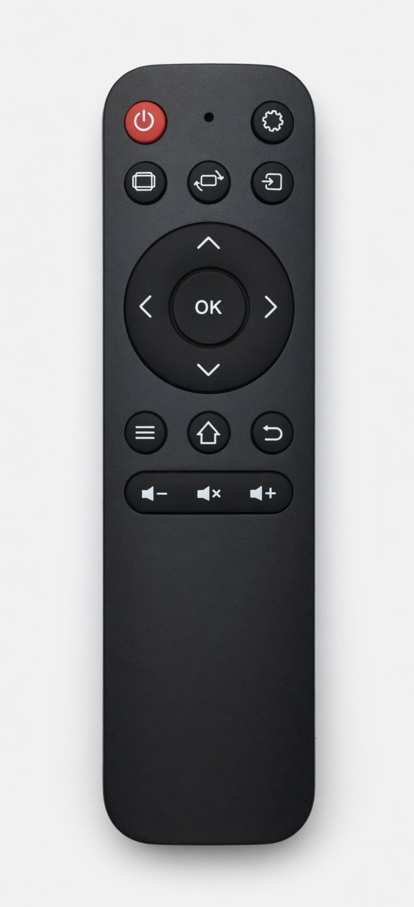
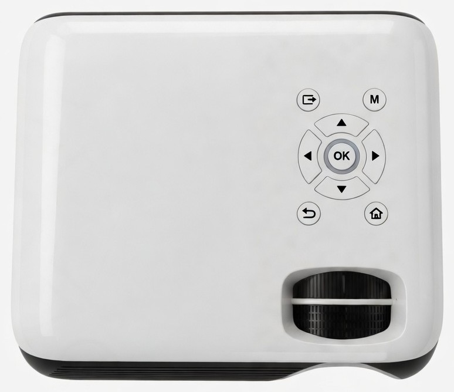
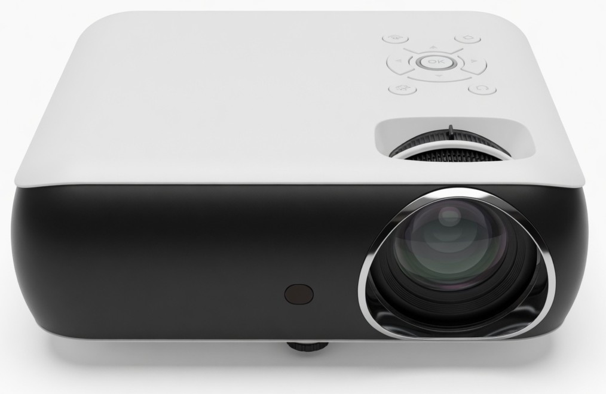
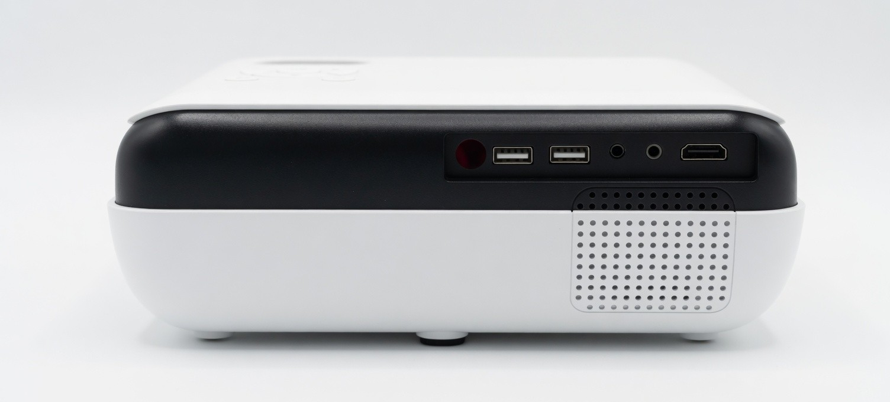
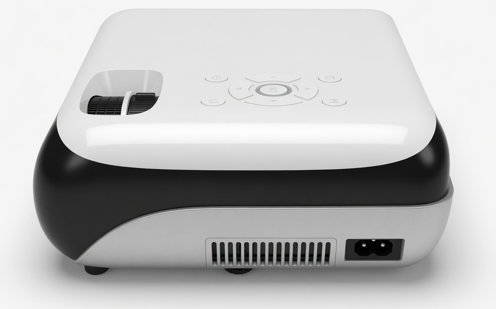
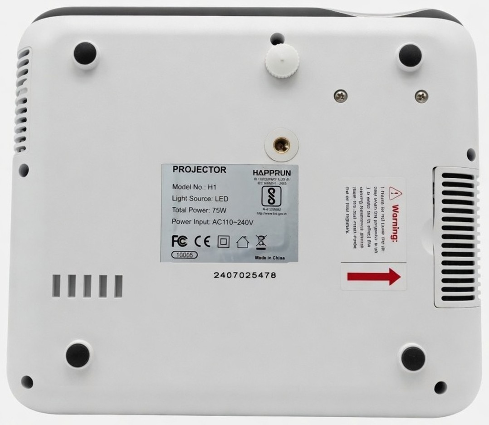
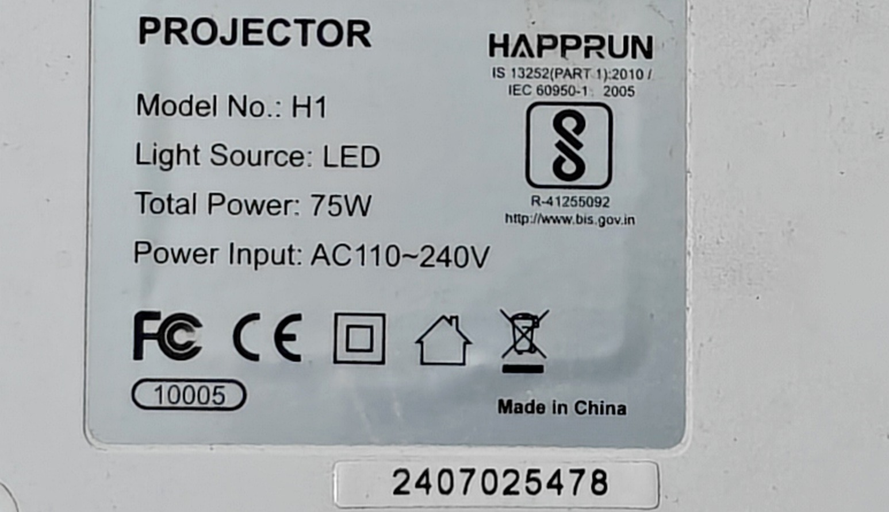

# HAPPRUN H1 projector

[Haprun](../) · [Projectors](../../) · [Infrared](../../../)

Portable 1080p LCD projector (white top, black mid-band). The bundled IR remote is a simple NEC clicker: power, input, picture, navigation, and volume. Focus and keystone are the two wheels in the top recess, not on the remote.













## Identification

The bottom rating plate is a crop of the real sticker (not redrawn), so the IDs below match the hardware.



| Field | Value |
|-------|--------|
| Brand on plate | HAPPRUN |
| Model | H1 |
| Light source | LED |
| Total power | 75 W |
| Power input | AC 110–240 V |
| Serial | `2407025478` |
| FC oval (on plate) | `10005` |
| BIS / ISI | `R-41255092` — IS 13252 (Part 1):2010 / IEC 60950-1:2005, [bis.gov.in](http://www.bis.gov.in) |
| FCC ID (grant, not printed as text on this sticker) | [`2A342-H1`](https://fccid.io/2A342-H1) |
| Grantee | Shenzhen Hifun Technology Co., Ltd. |
| Marks on plate | FC, CE, Class II, indoor-use, WEEE, Made in China |
| QC stamps | Q.C. PASSED 07.2024 and Q.C. PASSED 14 on the hardware; omitted from `unit-bottom.jpg` |

The plate uses the FC logo plus `10005`. It does **not** print `FCC ID: 2A342-H1`. That grant is the FCC listing for the H1 / H1 Pro family from Shenzhen Hifun (2.4 GHz and 5 GHz), which is how most people look this chassis up.

Rear ports, left to right: IR window, USB, USB, AV, headphone, HDMI. Speaker grille is below the HDMI side. IEC power inlet is on the adjacent short side.

## Flipper file

[`Haprun_H1.ir`](Haprun_H1.ir) — copy to the Flipper SD card under `infrared/`.

## Remote buttons

Layout matches the remote photo, top to bottom:

| Remote | Flipper name | NEC command |
|--------|--------------|-------------|
| Red power | Power | `0x14` |
| Gear | Settings | `0x47` |
| Screen | Aspect Ratio | `0x0C` |
| Screen with rotate arrows | Screen Flip | `0x0F` |
| Arrow into a square | Input | `0x0D` |
| D-pad / OK | Up Down Left Right Ok | `0x12` `0x13` `0x11` `0x10` `0x15` |
| Hamburger | Menu | `0x16` |
| House | Home | `0x1B` |
| Bent arrow | Back | `0x1A` |
| Speaker − / × / + | Volume Down, Mute, Volume Up | `0x40` `0x18` `0x48` |

All buttons use **NEC** with address **`0x02`**. In the `.ir` file that is:

```
protocol: NEC
address: 02 00 00 00
command: XX 00 00 00
```

Same address and commands will work from any NEC blaster (Flipper, ESPHome `remote_transmitter`, Arduino IRremote). There is no checksum beyond standard NEC inversion of the command byte, which the Flipper firmware adds when it sends a parsed NEC signal.

## Notes

- Power is a toggle. There is no separate on and off code.
- Input cycles HDMI / USB / AV through the on-screen source list.
- Screen Flip is for ceiling or rear throw.
- This remote has no dedicated Bluetooth key. Pairing is in the projector menu (Settings / Option). H1 Bluetooth is output to a speaker, not input from a phone.
- Listings spell the brand **HAPPRUN**; the remote itself is unbranded.
